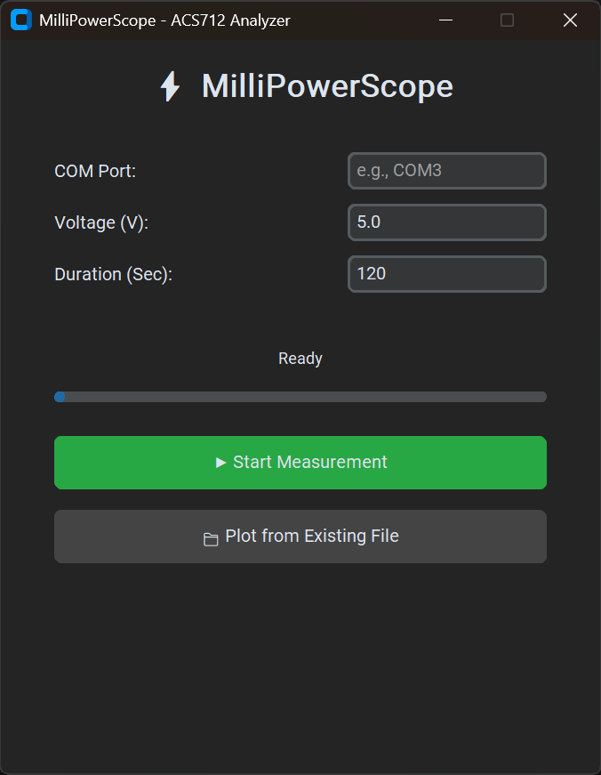

# MilliPowerScope ⚡

MilliPowerScope is a modern, GUI-based desktop application designed to measure, log, and visualize low-current electrical data using an Arduino and the ACS712 current sensor. 

Unlike standard serial monitors, this tool provides a professional dark-mode interface to record current (mA) and calculate power consumption (mW) over a user-defined duration. It automatically generates Excel reports and interactive oscilloscope-style plots.

## ✨ Features
* **Modern Dark GUI:** Clean and intuitive user interface built with CustomTkinter.
* **Real-Time Data Logging:** Reads serial data from Arduino without freezing the interface, utilizing multi-threading.
* **Milliwatt Precision:** Tailored for low-current projects, automatically calculating power in milliwatts ($P_{mW} = V \times I_{mA}$).
* **Automated Excel Reporting:** Saves each measurement session uniquely with a timestamped `.xlsx` file to prevent data overwrite.
* **Interactive Visualization:** Instantly plots Current vs. Time and Power vs. Time graphs upon completion.
* **Offline Plotting:** Load and visualize previously recorded Excel datasets anytime without needing a live Arduino connection.

## 🛠️ Requirements
* Python 3.8+
* Arduino Uno (or compatible) with an ACS712 (5A) Current Sensor
* Required Python libraries:
  ```bash
  pip install pyserial pandas matplotlib openpyxl customtkinter


[Measurements](Measurements_Viewer.png)
